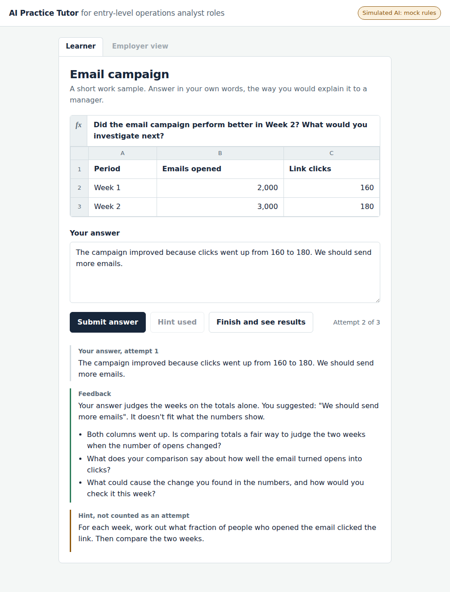
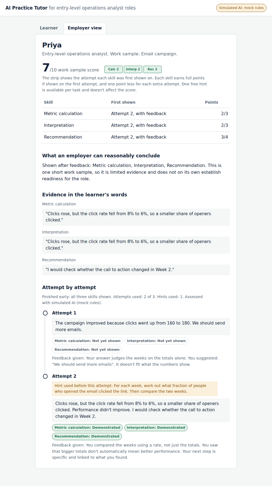

# AI Practice Tutor

A small AI practice loop that helps a learner practise a real work skill, improve with feedback, and produce evidence an employer can trust.

The learner answers a short data task in their own words. An LLM judges the answer against a fixed rubric and gives feedback that points at the gaps without giving the answer. The learner retries up to 3 times, then sees what they've shown, what's still missing, and their next step. If they choose to share, an employer sees a score out of 10 with the evidence behind it: quotes in the learner's words, the attempt each skill was first shown on, and an attempt-by-attempt timeline.

Built as a product prototype for entry-level operations analyst skills. Python standard library only, runs locally, with a mock mode that needs no API key.

**What makes it interesting:** the LLM only judges meaning. Everything that must never vary (the score, attempt limits, never leaking the answer, requiring evidence in the learner's own words) is enforced by code. See [DESIGN_NOTES.md](DESIGN_NOTES.md).

| Learner view | Employer view |
|---|---|
|  |  |

## Setup

### 1. Install Python

You need Python 3.9 or later. No other packages are needed.

- **Windows:** download it from python.org. During install, tick **"Add Python to PATH"**.
- **Mac:** download it from python.org, or run `brew install python`.

Check it worked by opening a terminal and running:

```
python --version
```

On Mac, use `python3` instead of `python` in every command below. On Windows, if `python` isn't recognised, try `py`.

### 2. Open a terminal in the project folder

Download or clone this repository and open its folder (the one containing `server.py`).

- **Windows:** click the folder's address bar, type `cmd`, press Enter.
- **Mac:** right-click the folder, choose **New Terminal at Folder**.

### 3. Start the app (mock mode, no key needed)

```
python server.py
```

You should see:

```
AI Practice Tutor running at http://localhost:8000 using simulated AI (mock rules)
```

Open **http://localhost:8000** in your browser. Keep the terminal open while you use the app. To stop the server, press **Ctrl+C** in the terminal.

Mock mode uses keyword rules instead of an AI, so feedback and hints are fixed text. Use it to check the flow.

### 4. Switch to live AI (OpenAI)

**Option A: a `.env` file (easiest)**

1. In the project folder, make a copy of `.env.example` and name it `.env`
2. Open `.env` in Notepad and replace `sk-your-key-here` with your OpenAI API key
3. Restart the server: `python server.py`

The server reads `.env` every time it starts, so you only do this once. On Windows, if Notepad saves it as `.env.txt`, choose "All files" as the file type when saving.

**Option B: set it in the terminal**

Windows Command Prompt:
```
set OPENAI_API_KEY=your-key
set TUTOR_MODE=openai
python server.py
```

Windows PowerShell:
```
$env:OPENAI_API_KEY="your-key"
$env:TUTOR_MODE="openai"
python server.py
```

Mac:
```
export OPENAI_API_KEY=your-key
TUTOR_MODE=openai python3 server.py
```

Values set in the terminal override `.env`.

Either way, the terminal should say `using live AI`, and the badge in the top right of the app should say **Live AI** with the model name.

**Never commit your `.env` file or share your key.** `.env` is already listed in `.gitignore`.

### 5. Settings

`config.json`:

| Setting | What it does |
|---|---|
| `mode` | `mock` or `openai`. `TUTOR_MODE` overrides it |
| `openai_model` | The OpenAI model to use. Change it if your key can't access the default |
| `temperature` | Set to `null` if your model rejects a temperature setting |
| `max_attempts` | Attempts per task (default 3) |
| `port` | Change if 8000 is busy, then open that port in the browser |

Restart the server after any change.

### 6. Run the tests

```
python run_tests.py --mode openai    # live (needs the key set as in step 4)
python run_tests.py --mode mock      # simulated, checks the plumbing only
```

This writes `tests/eval_log.md` with the input, expected behaviour, actual output and an auto check for each case. Add your own pass/fail judgement on feedback quality. Test cases are in `tests/test_cases.json`.

In mock mode, T2 fails because keyword rules don't recognise "a smaller share" as interpretation. That's deliberate evidence for why the product uses an LLM: compare the mock and live logs.

### Troubleshooting

| Problem | Fix |
|---|---|
| Browser says "localhost refused to connect" | The server isn't running. Start it (step 3) and keep the terminal open |
| `'python' is not recognized` | Python isn't installed or not on PATH. Reinstall and tick "Add Python to PATH", or try `py server.py` |
| `can't open file 'server.py'` | The terminal is in the wrong folder. Open it in the folder that contains `server.py` |
| `SyntaxError` when starting | Python is older than 3.9. Update it |
| `Address already in use` | Port 8000 is busy. Change `port` in `config.json` and open that port instead |
| Badge still says "Simulated AI" after step 4 | The key wasn't picked up. Check the file is named exactly `.env` (not `.env.txt`), is in the same folder as `server.py`, and that you restarted the server |
| "Feedback isn't available right now" | The OpenAI call failed. Check the terminal for the error: usually a wrong key, no credit, or a model name your key can't use |
| Changes don't show up | Stop and restart the server, then press Ctrl+F5 in the browser |

### No-code version

`prompts/chat_version.md` runs the same flow as a reusable conversation in free ChatGPT or Claude.

## Retakes and task variants

"Retake with a new task" gives the learner a variant they haven't seen: same rubric, same type of question, different data (email clicks, store purchases). A retake can't be passed by remembering the earlier answer. The employer view shows the current work sample, the full attempt timeline, and any earlier work samples the learner chose to share.

Each variant lives in `data/tasks/` with its own data, answer key, coaching text and leak terms. Add a variant by copying a file and changing the numbers and examples. The rubric in `data/rubric.json` stays the same.

## Saved sessions

Every session played in the browser is saved to `sessions/` as it happens:

- `*.md`: a readable transcript with the task, each attempt, the feedback and guiding questions shown, hints, blocked messages, the hidden assessment, product rules applied, and the final result. Useful as a shareable example of the full loop.
- `*.json`: the full record. Loaded back when the server starts, so learner history and retakes carry over.

Delete the `sessions/` folder to start fresh. Test runs are not saved here; they go to `tests/eval_log.md`.

## What's live and what's simulated

| Part | Status |
|---|---|
| Judging the learner's answer against the rubric | Live LLM (openai mode) |
| Feedback and guiding questions | Live LLM |
| Hints | Live LLM, with a fixed fallback per skill |
| Learner next step and employer conclusion | Live LLM, with a template fallback |
| Attempt limit, score, four-test rule, evidence check, answer-leak guard, guardrail messages | Code (product rules, deterministic) |
| Lesson links | Simulated (no course library) |
| Sharing with an employer | Simulated (unlocks the Employer view tab) |
| Learner accounts | Simulated (learners are matched by name) |
| Saved sessions and history | Works (files in `sessions/`, reloaded on start) |
| Task variants on retake | Works (2 hand-written variants) |
| Multi-learner employer list | Not built (deferred) |

## Model vs product rules

The model judges free text, because rules can't read meaning ("not really", "1 in 12.5", "20% drop"). Code enforces everything that must never vary:

- A recommendation is Demonstrated only if it passes all four tests. Code applies this from the model's test answers.
- A skill counts only if the model quotes the learner's own words. If the quote isn't in the answer, the skill is downgraded and flagged for review.
- If feedback or a hint contains an answer value the learner hasn't written (for example 8%, 6% or 25%), it is replaced with safe, fixed feedback.
- Guardrail replies are fixed messages, and don't count as attempts.
- If the model is unreachable or returns unreadable output (after one retry), the attempt isn't counted and the learner is asked to try again.
- The score is calculated in code from the attempt each skill was first shown.

## Change the rubric or the task

- `data/rubric.json`: skills, level descriptors, points, practice notes, guardrail messages (same for every task)
- `data/tasks/*.json`: one file per task variant with its data, question, answer key, nudges, hints and leak terms
- `prompts/`: the model prompts

Restart the server after editing.

## Files

```
.env.example           template for your API key (copy to .env)
docs/                  screenshots
DESIGN_NOTES.md        product thinking behind the design
server.py              server, product rules, mock and live modes
static/index.html      learner flow, progress view, employer view
data/                  rubric, lessons, and task variants in data/tasks/
prompts/               evaluate, hint, summary prompts, and the chat version
tests/                 test cases and the generated evaluation log
sessions/              saved sessions (created on first use)
run_tests.py           test runner
config.json            mode, model, attempts, port
```

All data is fictional.
